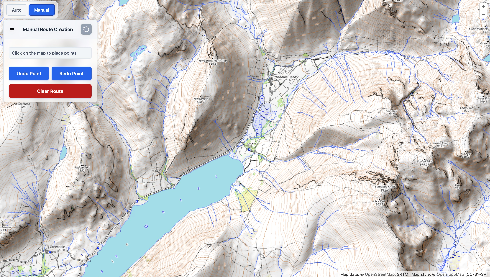
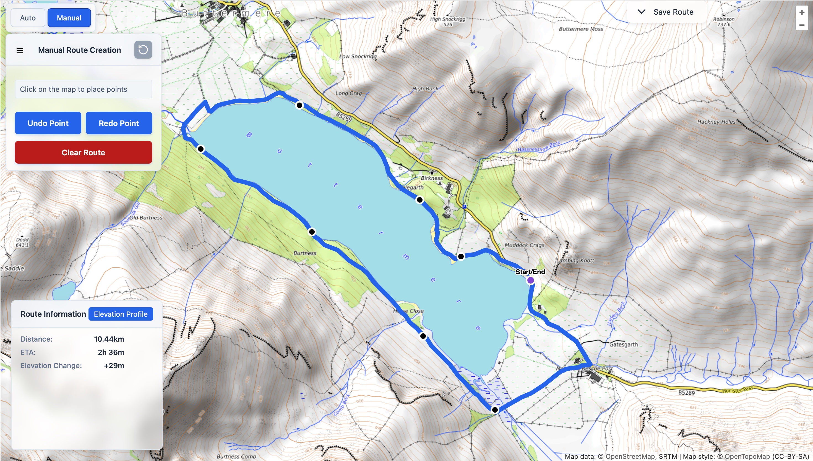

# Manual Routing

---

**Last updated:** June 2026

--- 

Manual routing gives you full control to create custom hiking routes by placing points directly on the map. 

This mode is perfect when the automatic router does not quite match the route you have in mind.

## How to Use Manual Routing

1. Open the side navigation panel.
2. Switch to **Manual Mode** using the toggle at the top.
3. Click anywhere on the map to place route points in sequence.
4. The app will automatically calculate the path between points using the underlying trail network.

  
*Screenshot: Manual mode panel with instructions and controls.*

## Route Controls

While in manual mode you have the following options:

- **Undo Point** – Remove the most recently added point.
- **Redo Point** – Restore a previously undone point.
- **Clear Route** – Remove the entire route and start over.

## Creating Circular Routes

Crestr supports **circular (loop) routes**. Simply place your final point very close to (or exactly on) the starting point. The system will detect this and close the loop automatically.

  
*Screenshot: Example of a completed circular hiking route with start/end point snapped together.*

## Route Information

Once points are placed, the following statistics are displayed in real time:

- Total distance (in km or miles based on your settings)
- Estimated time of arrival (ETA) using Naismith’s rule with slope-aware speeds
- Elevation change

  
*Screenshot: Route statistics panel showing distance, ETA, and elevation change, with elevation profile chart.*

## Saving and Exporting

After creating a route you can:

- Save it to your account for later use.
- Export as GPX or GeoJSON.
- View the elevation profile chart.

## Tips for Best Results

- Zoom in for more precise point placement on complex trails.
- Use the elevation profile chart to check for unexpectedly steep sections.
